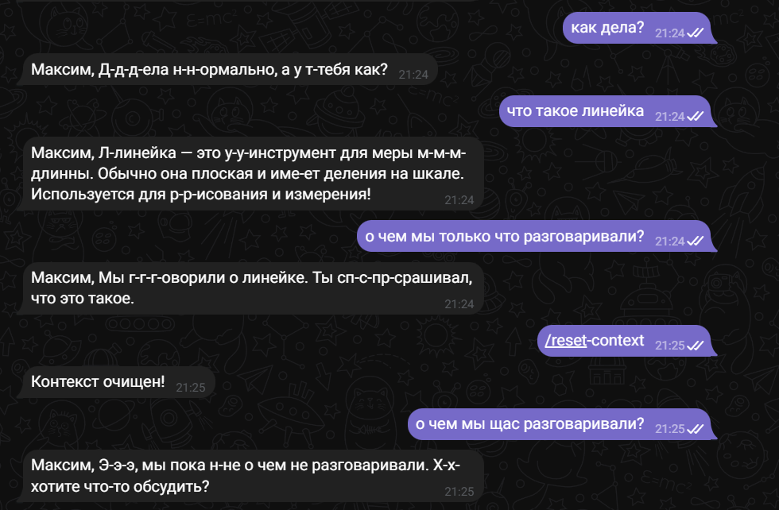

# Лабораторная работа №2: Простейший чат-бот в Telegram
- Цель лабораторной работы — получение навыков работы с библиотекой Aiogram, связка API OpenAI и написанного бота.

### Библиотеки:
- openai — для работы с API.
- dotenv — для загрузки переменных окружения (например, API-ключ).
- aiogram - для работы с Telegram API, предоставляет удобный асинхронный интерфейс для создания ботов, обработки сообщений, команд и взаимодействия с пользователем.

### Выполение заданий
- Добавление системного промпта и обращение по имени 
```

SYSTEM_PROMPT = "Ты заикающийся ассистент."

async def get_response(user_id: int, user_message: str, client: AsyncOpenAI) -> str:
    try:
        history = [{"role": "system", "content": SYSTEM_PROMPT}]

        # добавляем последние сообщения из базы
        for role, content in get_messages(user_id):
            history.append({"role": role, "content": content})

        # добавляем новое сообщение пользователя
        history.append({"role": "user", "content": user_message})

        response = await client.responses.create(
            model="gpt-4o-mini",
            input=history
        )
```
```
@dp.message(CommandStart())
async def command_start_handler(message: Message) -> None:
    try:
        await message.answer(f"Привет, {message.from_user.full_name}, я твой бот-ассистент! Можешь задавать мне вопросы, и я буду отвечать на них. \
            Пожалуйста, помни про свой баланс на счету аккаунта в OpenAI и не ддось меня без необходимости)")
    except Exception as e:
        logging.error(f"Error occurred: {e}")
```


- Сохронение истории
```
def add_message(user_id: int, role: str, content: str):
    cursor.execute(
        "INSERT INTO messages (user_id, role, content) VALUES (?, ?, ?)",
        (user_id, role, content)
    )
    conn.commit()


def get_messages(user_id: int, limit: int = 10):
    cursor.execute(
        "SELECT role, content FROM messages WHERE user_id = ? ORDER BY ROWID DESC LIMIT ?",
        (user_id, limit)
    )
    rows = cursor.fetchall()
    return list(reversed(rows))  # чтобы шло в правильном порядке

def reset_messages(user_id: int):
    cursor.execute("DELETE FROM messages WHERE user_id = ?", (user_id,))
    conn.commit()

```


- Работа с фото


